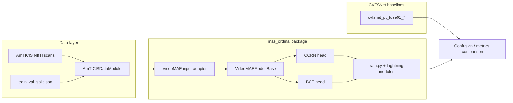

# VideoMAE mTICI Comprehensive Experiment Report

**Repository:** [CVFSNet](https://github.com/Farazsh/CVFSNet)  
**Branches:** `mae-ordinal-coronal` (ordinal), `mae-binary-mix` (binary)  
**Report date:** 2026-07-11  
**Status:** Complete — ordinal and binary VideoMAE experiments implemented, trained, evaluated, and compared against CVFSNet baselines.

This document consolidates the full VideoMAE investigation from three chat exports and repository artifacts:

- [`ORDINAL_DEVELOPMENT_REPORT.md`](ORDINAL_DEVELOPMENT_REPORT.md)
- [`BINARY_DEVELOPMENT_REPORT.md`](BINARY_DEVELOPMENT_REPORT.md)
- [`BINARY_EXPERIMENT_PLAN.md`](BINARY_EXPERIMENT_PLAN.md)

Supporting evidence: [`ORDINAL_EXPERIMENT_PLAN.md`](ORDINAL_EXPERIMENT_PLAN.md),
[`ORDINAL_RESULTS_REPORT.md`](ORDINAL_RESULTS_REPORT.md),
[`BINARY_RESULTS_REPORT.md`](BINARY_RESULTS_REPORT.md), [`mae_ordinal/`](../),
local run artifacts under `output_runs_lightning/`, and plots under `plots/`.

---

## Executive summary

Two sequential VideoMAE experiments were run on the AmTICIS DSA dataset for automatic mTICI scoring:

| Phase | Task | Views | Head / loss | Best result | vs CVFSNet baseline |
|-------|------|-------|-------------|-------------|---------------------|
| **1 — Ordinal** | 4-class `fuse01` grading | AP (coronal) only | CORN + full fine-tune | Acc **0.580**, F1 **0.497**, QWK **0.648** | Beats baseline on acc/F1/AUROC; **loses on QWK** (0.648 vs 0.698) |
| **2 — Binary** | T012a vs T2b3 | AP / sagittal / dual | BCE + full fine-tune | Dual acc **0.853**, F1 **0.853** | Beats collapsed fusion baseline by **+4.0%** acc |

**Critical finding across both phases:** the single most important engineering fix was **input normalization**. Feeding VideoMAE the pipeline's native `TioZNormalization(div255)` clips (std ≈ 0.004) caused complete model collapse. Restoring unit-scale input via **per-clip min-max → ImageNet mean/std** in the model adapter made learning possible.

**Clinical takeaway:** binary dual-view VideoMAE is the strongest classifier so far for separating incomplete/partial reperfusion (T0/T1/T2a) from near-complete/complete reperfusion (T2b/T3). However, ordinal VideoMAE still over-predicts T3 and under-predicts middle grades (T2a/T2b), and binary models are highly overconfident — especially dual-view.

**Figures:** Confusion-matrix plots generated from best-epoch checkpoints are saved locally under [`plots/`](../../plots/) — see [§ Confusion matrix figures](#confusion-matrix-figures-repository-plots) and the detailed result sections [§8.3](#83-confusion-matrices--ordinal-val-best-epoch) and [§9.3](#93-confusion-matrices--binary-val-best-epoch).

---

## Confusion matrix figures (repository plots)

The following figures are the **actual matplotlib outputs** stored in this repository (regenerated from saved checkpoints via `mae_ordinal.plot_confusion` and `mae_ordinal.plot_confusion_binary`). Each cell shows **raw count** (top) and **row-normalized recall** (bottom). All panels use the same 150-scan validation set.

### Figure 1 — Ordinal `fuse01` (4-class), AP-only

**File:** [`plots/confusion_matrices.png`](../../plots/confusion_matrices.png)  
**Generated by:** `uv run python -m mae_ordinal.plot_confusion`  
**Layout:** 1×3 panel — VideoMAE frozen | VideoMAE fine-tune | CVFSNet coronal baseline  
**Classes:** T0/1, T2a, T2b, T3

<p align="center">
  
</p>

*Figure 1. Ordinal confusion matrices (val, best epoch). Fine-tuned VideoMAE has the highest accuracy but the strongest T3 bias; CVFSNet has the best ordinal agreement (QWK).*

### Figure 2 — Binary T012a vs T2b3

**File:** [`plots/confusion_matrices_binary.png`](../../plots/confusion_matrices_binary.png)  
**Generated by:** `uv run python -m mae_ordinal.plot_confusion_binary`  
**Layout:** 3×2 grid — for each view (AP, sagittal, dual): VideoMAE (left) vs collapsed CVFSNet fuse01 baseline (right)  
**Classes:** T012a (0), T2b3 (1). CVFSNet baselines are post-hoc collapsed from 4-class fuse01 predictions.

<p align="center">
  
</p>

*Figure 2. Binary confusion matrices (val, best epoch). Dual-view VideoMAE (bottom-left) achieves the highest accuracy; AP-only VideoMAE (top-left) has the strongest T2b3 sensitivity.*

| Panel (row) | View | Left: VideoMAE | Right: CVFSNet (collapsed) |
|-------------|------|----------------|----------------------------|
| Top | AP (coronal) | acc 0.827, f1 0.826 | acc 0.813, f1 0.813 |
| Middle | Sagittal | acc 0.780, f1 0.779 | acc 0.767, f1 0.767 |
| Bottom | Dual (AP + sagittal) | acc **0.853**, f1 **0.853** | acc 0.813, f1 0.813 |

---

## 1. Project overview

### 1.1 Clinical problem

The modified Thrombolysis In Cerebral Infarction (mTICI) score assesses reperfusion success after mechanical thrombectomy from Digital Subtraction Angiography (DSA) in coronal and sagittal views. Manual scoring is slow and observer-dependent.

**CVFSNet** ([Xu et al., 2025](https://doi.org/10.1016/j.media.2025.103508)) is a dual-branch CNN with a Cross View Fusion Module (CVFM) trained end-to-end on the **AmTICIS** dataset ([Zenodo](https://zenodo.org/records/17790966)).

### 1.2 Research question

Can a **VideoMAE** video transformer backbone, pretrained on large-scale video data, outperform the coronal-only CVFSNet baseline when applied to mTICI grading — first as **ordinal regression**, then as a clinically motivated **binary** task?

### 1.3 Repository structure

The repo contains **two pipelines**:

| Pipeline | Location | Role |
|----------|----------|------|
| Legacy paper release | `main.py`, `Src/`, `Data/`, `Loss/`, `Lib/` | Original CVFSNet release |
| Active Lightning stack | `amticis_pipeline/` + `amticis_training/` | Reproduced baselines and ablations |

VideoMAE experiments live in a **separate package** [`mae_ordinal/`](../) that **imports but does not modify** the Lightning pipeline.



---

## 2. Dataset, splits, and labels

### 2.1 AmTICIS dataset

- **Modality:** grayscale DSA NIfTI volumes `(H, W, T)`
- **Split file:** [`train_val_split.json`](../../train_val_split.json), key `CORONAL_VIEW`
- **Views:** coronal (`_C`) and sagittal (`_S`) derived by filename substitution
- **Grade tokens:** `T0`, `T1`, `T2A`, `T2B`, `T3` parsed from filenames (no `T2C` in this dataset)

### 2.2 Split sizes and leakage check

| Split | Scans | Patient-like IDs (unique) | Train/val overlap |
|-------|------:|--------------------------:|------------------:|
| Train | 261 | 261 | 0 |
| Val | 150 | 150 | 0 |

**Important:** `amticis_pipeline/config.yaml` sets `splits.test: val`. There is **no held-out test set**; all reported numbers are validation-set performance with best-epoch-on-val checkpoint selection.

### 2.3 Label schemes used

Defined in [`amticis_pipeline/utils.py`](../../amticis_pipeline/utils.py):

| Mode | Mapping | Classes | Used in |
|------|---------|--------:|---------|
| `full` | T0→0, T1→1, T2A→2, T2B→3, T3→4 | 5 | — |
| `fuse01` | T0/T1→0, T2A→1, T2B→2, T3→3 | 4 | Ordinal experiment, CVFSNet baselines |
| `binary` | T0/T1/T2A→0, T2B/T3→1 | 2 | Binary experiment |

### 2.4 Class distribution

**Binary (`label_mode: binary`):**

| Split | T012a (0) | T2b3 (1) | Total |
|-------|----------:|---------:|------:|
| Train | 128 | 133 | 261 |
| Val | 80 | 70 | 150 |

**Ordinal (`fuse01`, 4-class):**

| Split | T0/T1 (0) | T2a (1) | T2b (2) | T3 (3) | Total |
|-------|----------:|--------:|--------:|-------:|------:|
| Train | 98 | 30 | 48 | 85 | 261 |
| Val | 51 | 29 | 23 | 47 | 150 |

T2a is the minority class in training (30/261 ≈ 11.5%). Imbalance is handled via `WeightedRandomSampler` (inverse frequency), matching the CVFSNet baseline protocol.

### 2.5 Clinical rationale for binary threshold

The binary split `{T0,T1,T2A} → 0` vs `{T2B,T3} → 1` separates **incomplete/partial reperfusion** from **near-complete/complete reperfusion**.

Clinically, TICI 2b and 3 are often grouped as "successful reperfusion" (≥50% territory filled), but evidence shows T3 outcomes are better than T2b ([Goyal et al., 2018](https://jnnp.bmj.com/content/89/9/910); [Sivaraju et al., 2020](https://www.sciencedirect.com/science/article/abs/pii/S1878875020300279)). The binary task therefore tests whether the model can distinguish **clinically actionable success tiers**, not just replicate the traditional 2b/3 grouping debate.

---

## 3. Data preprocessing pipeline

All VideoMAE experiments reuse the **existing AmTICIS Lightning pipeline** without forking transforms.

### 3.1 Loading and resampling

| Step | Implementation | Output |
|------|----------------|--------|
| Load NIfTI | `amticis_pipeline/utils.py::load_nifti` | `(H, W, T)` float32 |
| Temporal + spatial resample | `ResizeView` trilinear interpolate | `(1, T, H, W)` |
| VideoMAE override | `num_frames=16`, `image_size=224` via [`mae_ordinal/dataloader.py`](../dataloader.py) presets | `(1, 16, 224, 224)` |

Frame selection is **not** discrete sampling — native temporal length is resampled to 16 frames. This matches VideoMAE-Base's expected temporal positional embedding shape ([HF model card](https://huggingface.co/MCG-NJU/videomae-base-finetuned-kinetics)).

### 3.2 Augmentations (train only)

From [`amticis_pipeline/config.yaml`](../../amticis_pipeline/config.yaml): DSA-specific torchio augmentations (flip, motion, ghosting, spike, bias field, blur, noise, gamma), morphology (erode/dilate), rotation (±30°), random crop, then `TioZNormalization(div255=true)`.

Validation/test: **normalization only** (deterministic).

### 3.3 Normalization — the critical design decision

**Pipeline normalization (`TioZNormalization(div255)`):**
- Per-volume z-score → divide by 255
- Resulting std ≈ **0.004** (far below unit variance)

**Why this breaks VideoMAE:**
- VideoMAE has **no input BatchNorm** and adds **fixed sinusoidal position embeddings** before any LayerNorm ([Tong et al., 2022](https://arxiv.org/abs/2203.12602))
- With std ≈ 0.004, patch embeddings are ~250× smaller than position embeddings → sample-independent representations → **constant prediction collapse**
- CVFSNet (X3D-style CNN with BatchNorm) tolerates this scale; VideoMAE does not

**Fix implemented in [`mae_ordinal/model.py`](../model.py):**
1. Keep pipeline preprocessing unchanged (fair comparison with CVFSNet)
2. In the model adapter: **per-clip min-max → [0,1] → ImageNet mean/std** → channel replicate 1→3
3. Verified post-fix stats: mean ≈ 0.18, std ≈ 0.50, range ≈ [-2.1, 2.6]
4. Overfit sanity check reached **100% train accuracy** in a few steps

### 3.4 Sampling

`WeightedRandomSampler` with inverse class frequency (`loader.use_weighted_sampler: true`) — same mechanism as CVFSNet baselines.

---

## 4. Model architecture

### 4.1 Backbone

| Parameter | Choice | Source / rationale |
|-----------|--------|-------------------|
| Model | VideoMAE-**Base** (~86M params) | Small dataset (261 train); Large (~305M) would overfit ([plan](ORDINAL_EXPERIMENT_PLAN.md)) |
| Checkpoint | `MCG-NJU/videomae-base-finetuned-kinetics` | K400 fine-tuned encoder; semantically organized features ([HF](https://huggingface.co/MCG-NJU/videomae-base-finetuned-kinetics)) |
| Library | Hugging Face `transformers` `VideoMAEModel` | Maintained v1 path; v2 deferred |
| Input | 16 frames × 224×224 × 3 channels | Matches pretrained pos-emb exactly |
| Pooling | Mean over token sequence | VideoMAE default (no CLS token) ([FINETUNE.md](https://github.com/MCG-NJU/VideoMAE/blob/main/FINETUNE.md)) |

### 4.2 Ordinal head (`VideoMAEOrdinal`)

- **Formulation:** CORN (Conditional Ordinal Regression for Neural Networks) — [Shi et al., 2021](https://github.com/Raschka-research-group/corn-ml)
- **Output:** `K−1 = 3` logits for 4-class `fuse01`
- **Head:** LayerNorm → Dropout(0.5) → Linear(3)
- **Implementation:** [`mae_ordinal/ordinal.py`](../ordinal.py)

### 4.3 Binary head (`VideoMAEBinary` / `VideoMAEBinaryDual`)

- **Single-view:** mean-pool → LayerNorm → Dropout(0.5) → Linear(1) → BCE
- **Dual-view:** shared backbone encodes AP and sagittal separately; concat pooled features (1536-d) → binary head
- **Loss:** `binary_cross_entropy_with_logits` ([PyTorch docs](https://docs.pytorch.org/docs/stable/generated/torch.nn.BCEWithLogitsLoss.html))
- **Implementation:** [`mae_ordinal/binary_lightning_module.py`](../binary_lightning_module.py)

### 4.4 Parameter counts

| Configuration | Trainable params | Frozen params |
|---------------|----------------:|--------------:|
| Ordinal / binary full fine-tune | 86.2 M | 0 |
| Ordinal frozen (linear probe) | 3.8 K | 86.2 M |
| Binary dual (shared backbone) | ~86 M (one backbone + fusion head) | 0 |

---

## 5. Training protocol

### 5.1 Hyperparameters (VideoMAE literature sources)

Primary sources: [MCG-NJU VideoMAE FINETUNE.md](https://github.com/MCG-NJU/VideoMAE/blob/main/FINETUNE.md), [OpenGVLab VideoMAEv2](https://github.com/OpenGVLab/VideoMAEv2), [BEiT layer decay](https://github.com/microsoft/unilm/blob/master/beit/README.md).

#### Ordinal experiments

| | Frozen (linear probe) | Full fine-tune |
|---|:---:|:---:|
| Config | `config_frozen.yaml` | `config_finetune.yaml` |
| Trainable params | 3.8 K | 86.2 M |
| Optimizer | AdamW (β=0.9, 0.999) | AdamW (β=0.9, 0.999) |
| Base LR | 1e-3 | 2e-4 |
| Layer-wise LR decay | — | 0.75 |
| Weight decay | 1e-4 | 0.05 |
| Backbone dropout substitute | — (frozen) | hidden_dropout 0.1 |
| Schedule | 5-epoch warmup + cosine | 5-epoch warmup + cosine |
| Batch size | 16 | 8 |
| Max epochs / patience | 75 / 25 | 75 / 25 |
| Grad clip | 1.0 | 1.0 |
| Precision | 16-mixed | 16-mixed |
| GPU | 0 | 1 |

Note: HF VideoMAE has no stochastic depth (`drop_path`); `hidden_dropout_prob=0.1` approximates the paper's `drop_path=0.1`.

#### Binary experiments

| | AP | Sagittal | Dual |
|---|:---:|:---:|:---:|
| Config | `config_binary_ap.yaml` | `config_binary_sagittal.yaml` | `config_binary_dual.yaml` |
| View | AP | sagittal | AP + sagittal |
| Batch size | 8 | 8 | 4 (OOM avoidance) |
| LR / LLRD / wd | 2e-4 / 0.75 / 0.05 | same | same |
| Schedule | warmup 5 + cosine | same | same |
| Max epochs / patience | 75 / 25 | same | same |
| GPU | 0 | 1 | 2 |

All runs: seed **14207**, checkpoint monitor **`val/fuse/f1_macro`**, W&B project **`AmTICIS`**.

### 5.2 Evaluation protocol

- **Metrics accumulator:** [`amticis_training/classification_metrics.py`](../../amticis_training/classification_metrics.py) — accuracy, macro/per-class F1, precision, recall, specificity, AUROC, AUPRC
- **Ordinal extras:** QWK, MAE, off-by-one accuracy (logged separately)
- **Binary export:** per-scan sigmoid scores via [`mae_ordinal/eval_binary.py`](../eval_binary.py)
- **Confusion matrices:** [`mae_ordinal/plot_confusion.py`](../plot_confusion.py) (ordinal), [`mae_ordinal/plot_confusion_binary.py`](../plot_confusion_binary.py) (binary)

### 5.3 Baseline comparison protocol

| VideoMAE run | CVFSNet baseline | Comparison method |
|--------------|------------------|-------------------|
| Ordinal AP | `cvfsnet_pt_fuse01_cor_v1` | Direct 4-class metrics |
| Binary AP | `cvfsnet_pt_fuse01_cor_v1` | Post-hoc collapse: classes 0,1→0; 2,3→1 |
| Binary sagittal | `cvfsnet_pt_fuse01_sag_v1` | Same collapse |
| Binary dual | `cvfsnet_pt_fuse01_fusion_v1` | Same collapse |

**Caveat:** collapsed CVFSNet baselines were **not** trained with binary BCE — collapse is post-hoc on 4-class fuse01 predictions.

---

## 6. Chronological experiment narrative

### Phase 1 — Ordinal regression (branch `mae-ordinal-coronal`)

| Step | Event | Outcome |
|------|-------|---------|
| 1 | Plan written ([`ORDINAL_EXPERIMENT_PLAN.md`](ORDINAL_EXPERIMENT_PLAN.md)); repo investigated | Locked: AP-only, 16×224², fuse01, WeightedRandomSampler |
| 2 | Initial run with pipeline normalization only (no ImageNet adapter) | **Complete collapse** — constant class prediction, QWK≈0, train loss stuck ~0.6–0.7 |
| 3 | Root cause diagnosed: input std ≈ 0.004 vs expected ~1.0 | Documented in chat export |
| 4 | ImageNet adapter implemented; frozen vs fine-tune configs created | Overfit sanity check: 100% train acc in few steps |
| 5 | Parallel runs: frozen (GPU 0) + fine-tune (GPU 1) | Both learn; fine-tune clearly superior |
| 6 | Confusion matrices plotted vs CVFSNet coronal baseline | Fine-tune wins acc but **loses QWK** |
| 7 | Results written to [`ORDINAL_RESULTS_REPORT.md`](ORDINAL_RESULTS_REPORT.md) | W&B: frozen `8cz3h5eu`, fine-tune `wwujnf64` |

### Phase 2 — Binary classification (branch `mae-binary-mix`)

| Step | Event | Outcome |
|------|-------|---------|
| 1 | Plan: T012a vs T2b3, 3 parallel runs (AP / sag / dual) | User chose shared-backbone late fusion + collapsed CVFSNet baselines |
| 2 | `VideoMAEBinary` / `VideoMAEBinaryDual` + BCE module implemented | Reuses ImageNet adapter from ordinal phase |
| 3 | Parallel training on GPUs 0/1/2 | All three complete successfully |
| 4 | Sigmoid CSV export + confusion matrix plot | Dual best (acc 0.853); AP best AUROC (0.925) |
| 5 | Committed on `mae-binary-mix` (code only; artifacts gitignored) | [`BINARY_RESULTS_REPORT.md`](BINARY_RESULTS_REPORT.md) |

---

## 7. What worked and what did not

### 7.1 What worked

| Item | Evidence |
|------|----------|
| **ImageNet input adapter (min-max + mean/std)** | Resolved collapse; overfit test 100% train acc; both ordinal and binary learn |
| **Full fine-tuning over frozen backbone** | Ordinal: F1 0.497 vs 0.425 frozen; all metrics higher |
| **VideoMAE-Base on 261 clips** | Feasible on single RTX 3090 24 GB; training ~1–2 h per run |
| **CORN ordinal formulation** | QWK 0.648, MAE 0.640 — errors tend to adjacent grades |
| **Binary BCE with weighted sampling** | All three binary runs beat collapsed CVFSNet baselines |
| **Dual-view shared-backbone fusion** | +2.6% acc vs AP, +7.3% vs sagittal; +4.0% vs CVFSNet fusion baseline |
| **AP-only signal** | Highest AUROC (0.925); strong T3 detection (recall 0.971) |
| **Reusing existing pipeline/metrics** | Directly comparable keys (`val/fuse/f1_macro`, etc.) |

### 7.2 What did not work

| Item | Evidence | Root cause |
|------|----------|------------|
| **Pipeline-only normalization for VideoMAE** | Constant-output collapse, QWK≈0 | Input std ≈ 0.004; position embeddings dominate |
| **Initial full fine-tune at lr=1e-5 without adapter fix** | No learning for ~45 epochs | Combined scale + LR issues |
| **Frozen K400 features for DSA** | F1 0.425, diffuse confusion matrix | Domain shift Kinetics→medical DSA |
| **Middle-grade ordinal recall** | T2a recall 0.31, T2b 0.17 (fine-tune) | T3 bias; class imbalance |
| **Sagittal-only binary** | Weakest VideoMAE run (acc 0.780) | Sagittal view less discriminative alone |
| **Default 0.5 threshold without calibration** | Dual: 84.7% predictions with score <0.01 or >0.99 | Overconfident logits |
| **Logged AUROC via `binary_pseudologits()`** | Metrics CSV AUROC ≠ sigmoid CSV AUROC (see §10) | Doubled logit scale causes prob saturation |

---

## 8. Results — Phase 1: Ordinal regression

### 8.1 Summary table (val set, best epoch by `val/fuse/f1_macro`)

| Metric | VideoMAE frozen | VideoMAE fine-tune | CVFSNet coronal |
|--------|----------------:|---------------------:|----------------:|
| **Best epoch** | 45 | 45 | 292 |
| **F1 (macro)** | 0.425 | **0.497** | 0.479 |
| **Accuracy** | 0.447 | **0.580** | 0.547 |
| **Precision (macro)** | 0.463 | 0.547 | 0.499 |
| **Recall (macro)** | 0.451 | 0.509 | 0.484 |
| **Specificity (macro)** | 0.816 | 0.856 | 0.849 |
| **AUROC (macro)** | 0.687 | **0.745** | 0.701 |
| **QWK** | 0.346 | 0.648 | **0.698*** |
| **MAE (ordinal)** | 0.900 | 0.640 | n/a |

\*QWK for CVFSNet computed from checkpoint predictions (not logged during original baseline training).

**Source:** [`ORDINAL_RESULTS_REPORT.md`](ORDINAL_RESULTS_REPORT.md), metrics CSVs under `output_runs_lightning/mae_ordinal_fuse01_ap_*/csv/version_0/metrics.csv`.

### 8.2 Per-class recall @ best epoch

Classes: 0=T0/T1, 1=T2a, 2=T2b, 3=T3

| Model | T0/T1 | T2a | T2b | T3 |
|-------|------:|----:|----:|---:|
| VideoMAE frozen | 0.61 | 0.48 | 0.48 | 0.23 |
| VideoMAE fine-tune | 0.53 | 0.31 | 0.17 | **0.98** |
| CVFSNet coronal | **0.76** | 0.21 | 0.35 | 0.62 |

Fine-tuned VideoMAE **over-predicts T3** (98% recall) at the expense of T2a/T2b — accuracy is carried by extremes.

### 8.3 Confusion matrices — ordinal (val, best epoch)

Rows = actual, columns = predicted. Format: **count** (row-normalized recall).

See **Figure 1** above, or open the plot directly: [`plots/confusion_matrices.png`](../../plots/confusion_matrices.png).

<p align="center">
  
</p>

*Regenerate:* `uv run python -m mae_ordinal.plot_confusion`

#### VideoMAE frozen — acc=0.447, QWK=0.346

|  | T0/1 | T2a | T2b | T3 |
|--|-----:|----:|----:|---:|
| **T0/1** | 31 (0.61) | 10 (0.20) | 7 (0.14) | 3 (0.06) |
| **T2a** | 14 (0.48) | 14 (0.48) | 1 (0.03) | 0 (0.00) |
| **T2b** | 11 (0.48) | 12 (0.52) | 11 (0.48) | 2 (0.09) |
| **T3** | 12 (0.26) | 18 (0.38) | 16 (0.34) | 1 (0.02) |

#### VideoMAE fine-tune — acc=0.573*, QWK=0.647

|  | T0/1 | T2a | T2b | T3 |
|--|-----:|----:|----:|---:|
| **T0/1** | 27 (0.53) | 9 (0.18) | 13 (0.25) | 2 (0.04) |
| **T2a** | 10 (0.34) | 9 (0.31) | 18 (0.62) | 2 (0.07) |
| **T2b** | 0 (0.00) | 18 (0.78) | 4 (0.17) | 12 (0.52) |
| **T3** | 0 (0.00) | 1 (0.02) | 0 (0.00) | **46 (0.98)** |

\*Checkpoint-recomputed accuracy (0.573) differs slightly from logged best-epoch value (0.580) — see §10.

#### CVFSNet coronal baseline — acc=0.547, QWK=0.698

|  | T0/1 | T2a | T2b | T3 |
|--|-----:|----:|----:|---:|
| **T0/1** | 39 (0.76) | 9 (0.18) | 2 (0.04) | 1 (0.02) |
| **T2a** | 20 (0.69) | 6 (0.21) | 2 (0.07) | 1 (0.03) |
| **T2b** | 12 (0.52) | 2 (0.09) | 8 (0.35) | 1 (0.04) |
| **T3** | 11 (0.23) | 4 (0.09) | 3 (0.06) | 29 (0.62) |

**Interpretation:** CVFSNet has the best **ordinal agreement** (QWK 0.698) because its errors land closer to true grades. VideoMAE fine-tune wins **accuracy/F1** by confidently nailing T3 while collapsing T2a/T2b into T3.

---

## 9. Results — Phase 2: Binary T012a vs T2b3

### 9.1 Summary table (val set, best checkpoint)

| Run | View | Best epoch | Accuracy | F1 macro | AUROC† | AUPRC† | Sensitivity | Specificity | PPV | NPV |
|-----|------|----------:|---------:|---------:|-------:|-------:|------------:|------------:|----:|----:|
| `mae_binary_t012a_ap` | AP | 49 | **0.827** | **0.826** | **0.925** | 0.912 | 0.971 | 0.700 | 0.739 | 0.966 |
| `mae_binary_t012a_sag` | Sagittal | 49 | 0.780 | 0.779 | 0.845 | 0.779 | 0.900 | 0.675 | 0.708 | 0.885 |
| `mae_binary_t012a_dual` | AP + sagittal | 61 | **0.853** | **0.853** | 0.895 | 0.834 | 0.971 | 0.750 | 0.773 | 0.968 |

†AUROC/AUPRC computed from exported **sigmoid scores** ([`val_sigmoid_scores.csv`](../../output_runs_lightning/mae_binary_t012a_ap/val_sigmoid_scores.csv)); see §10 for discrepancy with logged metrics.

### 9.2 vs collapsed CVFSNet baselines

| View | VideoMAE acc | CVFSNet collapsed acc | Δ acc |
|------|-------------:|------------------------:|------:|
| AP | 0.827 | 0.813 | +0.014 |
| Sagittal | 0.780 | 0.767 | +0.013 |
| Dual | **0.853** | 0.813 | **+0.040** |

### 9.3 Confusion matrices — binary (val, best epoch)

Rows = actual, columns = predicted. Classes: **T012a** (0), **T2b3** (1).

See **Figure 2** above, or open the plot directly: [`plots/confusion_matrices_binary.png`](../../plots/confusion_matrices_binary.png).

<p align="center">
  
</p>

*Regenerate:* `uv run python -m mae_ordinal.plot_confusion_binary`

#### VideoMAE AP — acc=0.827, f1=0.826

|  | T012a | T2b3 |
|--|------:|-----:|
| **T012a** | 56 (0.70) | 24 (0.30) |
| **T2b3** | 2 (0.03) | 68 (0.97) |

#### CVFSNet AP (collapsed) — acc=0.813, f1=0.813

|  | T012a | T2b3 |
|--|------:|-----:|
| **T012a** | 60 (0.75) | 20 (0.25) |
| **T2b3** | 8 (0.11) | 62 (0.89) |

#### VideoMAE sagittal — acc=0.780, f1=0.779

|  | T012a | T2b3 |
|--|------:|-----:|
| **T012a** | 54 (0.68) | 26 (0.33) |
| **T2b3** | 7 (0.10) | 63 (0.90) |

#### CVFSNet sagittal (collapsed) — acc=0.767, f1=0.767

|  | T012a | T2b3 |
|--|------:|-----:|
| **T012a** | 56 (0.70) | 24 (0.30) |
| **T2b3** | 11 (0.16) | 59 (0.84) |

#### VideoMAE dual — acc=0.853, f1=0.853

|  | T012a | T2b3 |
|--|------:|-----:|
| **T012a** | 60 (0.75) | 20 (0.25) |
| **T2b3** | 2 (0.03) | 68 (0.97) |

#### CVFSNet dual (collapsed) — acc=0.813, f1=0.813

|  | T012a | T2b3 |
|--|------:|-----:|
| **T012a** | 63 (0.79) | 17 (0.21) |
| **T2b3** | 11 (0.16) | 59 (0.84) |

### 9.4 Per raw-grade accuracy (derived from sigmoid CSVs)

| Raw grade | AP | Sagittal | Dual | n (val) |
|-----------|---:|---------:|-----:|--------:|
| T0 | 0.811 | 0.811 | **0.946** | 37 |
| T1 | 0.857 | 0.786 | **0.929** | 14 |
| **T2A** | **0.483** | 0.448 | 0.414 | 29 |
| T2B | 0.913 | 0.783 | 0.913 | 23 |
| T3 | 1.000 | 0.957 | 1.000 | 47 |

**T2A is consistently the hardest grade** across all views — this is the primary source of T012a false positives (partial reperfusion misclassified as success).

### 9.5 Calibration and confidence

| Run | Brier score | Log loss | Predictions with score <0.01 or >0.99 |
|-----|------------:|---------:|----------------------------------------:|
| AP | 0.165 | 0.884 | 80.0% |
| Sagittal | 0.201 | 0.947 | 68.7% |
| Dual | 0.145 | 1.869* | **84.7%** |

\*Dual log loss inflated by numerical saturation at prob≈1.0 (see §10).

Models are **highly overconfident** — most predictions are near 0 or 1. This makes the default 0.5 threshold suboptimal for clinical deployment without calibration.

### 9.6 Cross-view disagreement (150 val scans)

| Pair | Disagreements | AP-only correct | Other-only correct | Both wrong |
|------|-------------:|----------------:|-------------------:|-----------:|
| AP vs sagittal | 31 | 19 | 12 | 14 |
| AP vs dual | 14 | 5 | 9 | 17 |
| Sagittal vs dual | 29 | 9 | 20 | 13 |

Dual resolves many AP/sagittal disagreements in favor of dual, but introduces its own errors on 17 scans where AP was correct.

---

## 10. Metric audit and known discrepancies

| Issue | Logged value | Verified value | Cause |
|-------|-------------|---------------|-------|
| Binary AP AUROC | 0.896 (metrics CSV) | **0.925** (sigmoid CSV) | `binary_pseudologits()` doubles logit → softmax saturation |
| Binary dual AUROC | 0.881 (metrics CSV) | **0.895** (sigmoid CSV) | Same |
| Ordinal fine-tune acc | 0.580 (metrics CSV) | 0.573 (checkpoint reload) | Rounding / decoding path difference |
| Dual log loss | 1.518 (metrics CSV) | — | Extreme sigmoid scores (≈1.0) cause log(1−p) underflow artifacts |

**Recommendation for next phase:** report AUROC/AUPRC from raw sigmoid scores, not from `ClassificationMetricAccumulator` pseudo-logits. Fix: use `[−logit, logit]` or pass sigmoid probabilities directly.

---

## 11. Limitations

### 11.1 Experimental design

- **No held-out test set** (`test = val`); all numbers are validation performance
- **Best-epoch-on-val selection** → optimistic estimates
- **Single seed** (14207); margins on 150 val samples are within noise
- **`deterministic: false`** in trainer config → exact reproduction may vary slightly
- **One-center dataset** (AmTICIS); no external validation

### 11.2 Model and data

- **Tiny training set** (261 clips) for an 86M transformer → overfitting after ~epoch 45
- **Domain shift:** Kinetics-400 → medical DSA (pretrained features not medical)
- **Temporal resampling** (trilinear to 16 frames) may lose clinically relevant temporal dynamics
- **Grayscale → RGB replication** is standard but not validated against true RGB or learned channel mapping
- **Transformers 5.x** reinitializes VideoMAE q/v attention biases on load (minor degradation)

### 11.3 Comparison fairness

- **CVFSNet binary baselines are post-hoc collapsed**, not natively BCE-trained
- **No native binary CVFSNet control** exists in the repo (`cvfsnet_pt_binary_*` runs exist but were not used for the published comparison)
- **Ordinal QWK comparison** required recomputing baseline QWK from checkpoint (not originally logged)

### 11.4 Clinical deployment

- **Uncalibrated probabilities** — 80–85% of predictions are near 0 or 1
- **T2A misclassification** is systematic (partial reperfusion → success)
- **No confidence intervals** or statistical significance testing ([TRIPOD+AI](https://www.bmj.com/content/385/bmj-2023-078378) recommends CIs for all performance estimates)
- **No subgroup analysis** (anterior vs posterior circulation, stroke severity, etc.)

---

## 12. Recommended next steps (prioritized)

### Tier 1 — Must do before claiming clinical utility

1. **Create a proper held-out test split** (or nested/repeated patient-level cross-validation) with confidence intervals ([Sengupta et al., 2021](https://pubs.rsna.org/doi/10.1148/ryai.220232))
2. **Fix binary metric pipeline** — report AUROC from raw sigmoid scores; fix `binary_pseudologits()` saturation
3. **Train native binary CVFSNet controls** (AP / sag / dual with `label_mode: binary` + BCE) for apples-to-apples comparison
4. **Multi-seed averaging** (≥3 seeds) with mean ± std reporting
5. **Threshold optimization and calibration** — Platt scaling or isotonic regression on training folds only; report sensitivity/specificity at clinically chosen operating points

### Tier 2 — Likely to improve performance

6. **Class-weighted CORN / focal BCE** to recover T2a/T2b (ordinal) and T2A (binary) recall
7. **Use `corn_predict` (rank-consistent decoding)** for ordinal reporting instead of argmax on derived probs
8. **Compare fusion strategies:** shared backbone (current) vs dual independent encoders vs CVFSNet-style CVFM
9. **Try SSL-only checkpoint** (`videomae-base` without K400 fine-tune) vs current K400-finetuned
10. **Frame count ablation:** 8 vs 16 vs 32 frames (temporal resolution tradeoff)
11. **Per-grade error analysis** on misclassified T2A cases — inspect DSA clips manually

### Tier 3 — Research extensions

12. **Ordinal → binary cascade:** train ordinal first, derive binary decision from cumulative link
13. **T2b vs T3 sub-task:** given clinical debate on "successful reperfusion" definition
14. **VideoMAE v2** (`OpenGVLab/VideoMAEv2`) if v1 plateaus
15. **Self-supervised pre-training on AmTICIS** (masked autoencoding on DSA) before fine-tuning
16. **External validation** on another stroke center's DSA data
17. **Pin transformers version** to fix q/v bias loading

---

## 13. Reproducibility

### 13.1 Environment

- Python 3.11, `uv` package manager, torch 2.4.1+cu121
- `transformers` (added for VideoMAE), pytorch-lightning ≥2.6
- 4× NVIDIA RTX 3090 24 GB

### 13.2 Commands

**Ordinal:**
```bash
# Frozen (GPU 0)
CUDA_VISIBLE_DEVICES=0 uv run python -m mae_ordinal.train --config mae_ordinal/config_frozen.yaml

# Fine-tune (GPU 1)
CUDA_VISIBLE_DEVICES=1 uv run python -m mae_ordinal.train --config mae_ordinal/config_finetune.yaml

# Plot confusion matrices
uv run python -m mae_ordinal.plot_confusion
```

**Binary:**
```bash
CUDA_VISIBLE_DEVICES=0 uv run python -m mae_ordinal.train --config mae_ordinal/config_binary_ap.yaml
CUDA_VISIBLE_DEVICES=1 uv run python -m mae_ordinal.train --config mae_ordinal/config_binary_sagittal.yaml
CUDA_VISIBLE_DEVICES=2 uv run python -m mae_ordinal.train --config mae_ordinal/config_binary_dual.yaml

uv run python -m mae_ordinal.eval_binary
uv run python -m mae_ordinal.plot_confusion_binary
```

### 13.3 Artifact locations

| Artifact | Path |
|----------|------|
| Ordinal frozen checkpoint | `output_runs_lightning/mae_ordinal_fuse01_ap_frozen/csv/version_0/checkpoints/epoch=045.ckpt` |
| Ordinal fine-tune checkpoint | `output_runs_lightning/mae_ordinal_fuse01_ap_finetune/csv/version_0/checkpoints/epoch=045.ckpt` |
| Binary AP checkpoint | `output_runs_lightning/mae_binary_t012a_ap/csv/version_0/checkpoints/epoch=049.ckpt` |
| Binary sag checkpoint | `output_runs_lightning/mae_binary_t012a_sag/csv/version_0/checkpoints/epoch=049.ckpt` |
| Binary dual checkpoint | `output_runs_lightning/mae_binary_t012a_dual/csv/version_0/checkpoints/epoch=061.ckpt` |
| Binary sigmoid CSVs | `output_runs_lightning/mae_binary_t012a_*/val_sigmoid_scores.csv` |
| Ordinal confusion plot | `plots/confusion_matrices.png` |
| Binary confusion plot | `plots/confusion_matrices_binary.png` |
| W&B project | `AmTICIS` (frozen: `8cz3h5eu`, fine-tune: `wwujnf64`) |

Large artifacts (checkpoints ~1 GB each, CSVs, plots) are **gitignored** and remain local only.

### 13.4 Git branches

| Branch | Content | Commit |
|--------|---------|--------|
| `mae-ordinal-coronal` | Ordinal experiment + chat export | `fefee2e` |
| `mae-binary-mix` | Binary experiment + docs | `b5c8869` |

---

## 14. References

1. Tong, Z., Song, Y., Wang, J., & Wang, L. (2022). VideoMAE: Masked Autoencoders are Data-Efficient Learners for Self-Supervised Video Pre-Training. *NeurIPS 2022*. https://arxiv.org/abs/2203.12602
2. MCG-NJU VideoMAE official repository and FINETUNE.md. https://github.com/MCG-NJU/VideoMAE
3. Hugging Face: `MCG-NJU/videomae-base-finetuned-kinetics`. https://huggingface.co/MCG-NJU/videomae-base-finetuned-kinetics
4. Xu, W., et al. (2025). CVFSNet: A Cross View Fusion Scoring Network for end-to-end mTICI scoring. *Medical Image Analysis*, 102, 103508. https://doi.org/10.1016/j.media.2025.103508
5. Shi, X., Niu, M., Cao, W., & Raschka, S. (2021). CORN: Conditional Ordinal Regression for Neural Networks. https://github.com/Raschka-research-group/corn-ml
6. Bao, H., Dong, L., Piao, S., & Wei, F. (2022). BEiT: BERT Pre-Training of Image Transformers. *ICLR 2022*. (Layer-wise LR decay). https://github.com/microsoft/unilm/tree/master/beit
7. PyTorch: `BCEWithLogitsLoss`. https://docs.pytorch.org/docs/stable/generated/torch.nn.BCEWithLogitsLoss.html
8. Loshchilov, I. & Hutter, F. (2019). Decoupled Weight Decay Regularization (AdamW). *ICLR 2019*.
9. Goyal, N., et al. (2018). Comparative analysis of TICI 2b vs TICI 3 reperfusion. *JNNP*, 89(9), 910–916. https://jnnp.bmj.com/content/89/9/910
10. Sivaraju, A., et al. (2020). TICI 2C/3 vs 2B for endovascular thrombectomy. *Clinical Neurology and Neurosurgery*. https://www.sciencedirect.com/science/article/abs/pii/S1878875020300279
11. Collins, G.S., et al. (2024). TRIPOD+AI statement. *BMJ*, 385. https://www.bmj.com/content/385/bmj-2023-078378
12. Sengupta, P.P., et al. (2022). A Guide to Cross-Validation for AI in Medical Imaging. *Radiology: AI*. https://pubs.rsna.org/doi/10.1148/ryai.220232
13. AmTICIS dataset. https://zenodo.org/records/17790966

---

## Appendix A — File map for `mae_ordinal/`

| File | Purpose |
|------|---------|
| [`dataloader.py`](../dataloader.py) | View presets (coronal, AP/sag/dual binary) wrapping `AmTICISDataModule` |
| [`model.py`](../model.py) | VideoMAE adapter, ordinal/binary/dual heads, LLRD param groups |
| [`ordinal.py`](../ordinal.py) | CORN loss, rank/probability decoders |
| [`lightning_module.py`](../lightning_module.py) | Ordinal Lightning module + QWK/MAE |
| [`binary_lightning_module.py`](../binary_lightning_module.py) | Binary BCE Lightning module |
| [`train.py`](../train.py) | Entry point (routes ordinal vs binary by config) |
| [`eval_binary.py`](../eval_binary.py) | Checkpoint eval + sigmoid CSV export |
| [`plot_confusion.py`](../plot_confusion.py) | Ordinal 4×4 confusion matrices |
| [`plot_confusion_binary.py`](../plot_confusion_binary.py) | Binary 2×2 confusion matrices |
| [`config_frozen.yaml`](../config_frozen.yaml) | Ordinal frozen linear-probe config |
| [`config_finetune.yaml`](../config_finetune.yaml) | Ordinal full fine-tune config |
| [`config_binary_ap.yaml`](../config_binary_ap.yaml) | Binary AP config |
| [`config_binary_sagittal.yaml`](../config_binary_sagittal.yaml) | Binary sagittal config |
| [`config_binary_dual.yaml`](../config_binary_dual.yaml) | Binary dual-view config |

## Appendix B — W&B runs

| Run | W&B ID | URL |
|-----|--------|-----|
| Ordinal frozen | `8cz3h5eu` | https://wandb.ai/pytorch-vertebra/AmTICIS/runs/8cz3h5eu |
| Ordinal fine-tune | `wwujnf64` | https://wandb.ai/pytorch-vertebra/AmTICIS/runs/wwujnf64 |
| Initial collapsed run | `tz4oxjp7` | https://wandb.ai/pytorch-vertebra/AmTICIS/runs/tz4oxjp7 |

Binary runs were tracked under project `AmTICIS` with tags `[videomae, binary, bce, t012a, ap/sagittal/dual, finetune]`; specific run IDs are in the respective `output_runs_lightning/mae_binary_t012a_*/` W&B metadata.
